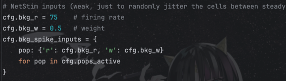
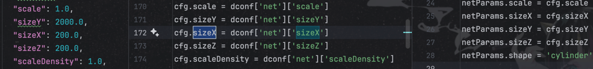
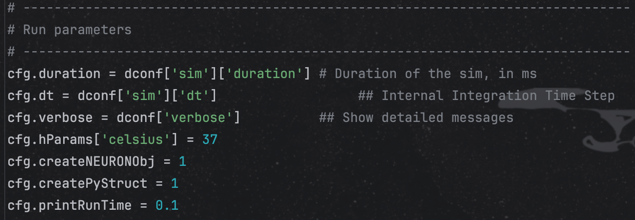
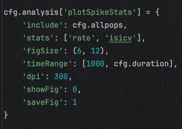
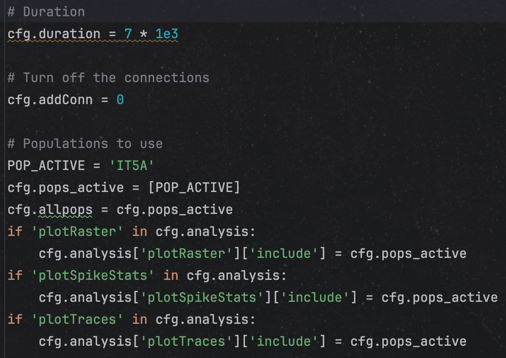

# Changes

This document outlines the changes made to the simulation configuration and network parameter files.

## 1. Configuration and Network Parameter Consolidation

- **Consolidated `cfg.py` and `cfg_base.py` into `cfg_new.py`**:
  - The base configuration from `cfg_base.py` and the modifications from `cfg.py` were merged into a single file, `cfg_new.py`.
  - This new file contains the complete configuration for the simulation.

- **Consolidated `netParams.py` and `netParams_base.py` into `netParams_new.py`**:
  - The base network parameters from `netParams_base.py` and the modifications from `netParams.py` were merged into a single file, `netParams_new.py`.
  - This new file contains the complete network parameter definition for the simulation.

## 2. Simplification and Refactoring

- **Hardcoded Simulation-Specific Parameters**:
  - The configuration and network parameter files were simplified by hardcoding the values that are specific to the simulation run initiated by `init.py`.
  - This was based on the assumption that the final state of the `cfg` object is the only relevant one.

- **Removed Unused Code and Parameters**:
  - Conditional blocks in `netParams_new.py` that were not relevant to the specific simulation case (e.g., `cfg.pops_active` being `['IT5A']`) were removed.
  - Unused synaptic mechanism definitions were removed from `netParams_new.py`. The only remaining mechanism is 'AMPA'.
  - Unused connectivity and gain-related configurations were removed from `cfg_new.py`.

## 3. Entry Point Update

- **Updated `init.py`**:
  - The main simulation script, `init.py`, was updated to import the consolidated and simplified configuration and network parameters from `cfg_new.py` and `netParams_new.py`.
  - The line `from netParams import cfg, netParams` was replaced with `from netParams_new import cfg, netParams`.

# Comprehensive Refactoring for Single-Cell Tuning

This document provides a comprehensive and explicit summary of the refactoring from a complex, full-network configuration to a simplified, self-contained setup for the specific purpose of **single-cell tuning**.

The original system, composed of `cfg.py`, `cfg_base.py`, `netParams.py`, and `netParams_base.py`, defined an entire, interconnected thalamocortical network. For tuning the properties of a single cell type, this included many extraneous attributes and dependencies.

The new, improved files, `cfg_new.py` and `netParams_new.py`, are streamlined and standalone, containing only the necessary parameters for single-cell experiments. This document fully enumerates the attributes that were removed to achieve this simplification.

---

## Configuration Simplification: `cfg_new.py`

`cfg_new.py` was created as a standalone configuration file, removing the dependencies on `cfg_base.py` and its associated JSON files. This was achieved by eliminating parameters related to full-network simulation.

### Removed Attributes for Simplification

The following parameters, present in the original `cfg`/`cfg_base` structure, were removed in `cfg_new.py` as they are irrelevant to single-cell tuning:

- **Multi-Population Definitions:** Removed lists defining all 40+ populations, including:
    - `allpops`
    - `allCorticalPops`
    - `allThalPops`
    - `Epops`
    - `Ipops`
    - `TEpops`
    - `TIpops`

- **Network Connectivity Parameters:**
    - All network-wide connection flags: `addConn`, `addSubConn`, `wireCortex`.
    - All flags for thalamic and cortico-thalamic connections: `addIntraThalamicConn`, `addCorticoThalamicConn`, `addThalamoCorticalConn`.
    - All synaptic gain parameters for the full network:
        - `EEGain`, `EIGain`, `IEGain`, `IIGain`
        - `EICellTypeGain`, `IECellTypeGain`
        - `EEPopGain`, `EIPopGain`
        - `EELayerGain`, `EILayerGain`, `IELayerGain`, `IILayerGain`
        - `intraThalamicGain`, `corticoThalamicGain`, `thalamoCorticalGain`
        - `intraThalamicCoreEEGain`, `intraThalamicCoreEIGain`, `intraThalamicCoreIEGain`, `intraThalamicCoreIIGain`
        - `intraThalamicEEGain`, `intraThalamicEIGain`, `intraThalamicIEGain`, `intraThalamicIIGain`
    - All layer- and cell-specific connectivity gains:
        - `thalL4PV`, `thalL4SOM`, `thalL4E`, `thalL4VIP`, `thalL4NGF`, `thalL1NGF`, `ENGF1`
        - `L4L3E`, `L4L3PV`, `L4L3SOM`, `L4L3VIP`, `L4L3NGF`

- **Complex External Inputs:**
    - Removed definitions for complex inputs not used in single-cell f-I curve experiments, including all parameters related to `ICThalInput` and `cochlearThalInput`.
    - Removed the `wmat` (weight matrix) loaded from `conn/conn.pkl`.

- **Dynamic/Inherited Logic:**
    - Removed logic that dynamically configured paths or loaded populations from external files like `pops_sz.csv`, as the setup is now static and explicit for a single population.
    - Removed the dependency on `data/cfg_base.json`, which housed many of the network-specific parameters listed above.

### Kept & Clarified Attributes

- **Core Run Parameters:** Essential parameters like `duration` and `dt` were kept.
- **Targeted Inputs:** The specific Ornstein-Uhlenbeck (OU) current parameters (`add_ou_current`, `OUamp`, `OUstd`, `ou_tau`) and background `NetStim` rates (`bkg_r`, `bkg_w`) needed for the experiment were kept and are now primary components of the file.
- **Mechanism Modification:** A clear, self-contained structure `multiply_parameters` was defined to handle changes to cell mechanisms, replacing the less direct `mech_changes` dictionary from the experimental `cfg.py`.
- **Recording:** Recording is explicitly defined for the single population of interest (`IT5A`).

---

## Network Simplification: `netParams_new.py`

`netParams_new.py` is a self-contained network definition file. It replaces the previous system where `netParams.py` would dynamically modify the massive, full-network definition loaded from `netParams_base.py`.

### Removed Network Definitions

To focus only on the components needed for a single-cell experiment, the following were removed from the original `netParams`/`netParams_base` structure:

- **All Population Definitions Except One:** All `popParams` entries were removed, leaving only the definition for `IT5A`. The removed populations were:
    - `NGF1`, `IT2`, `SOM2`, `PV2`, `VIP2`, `NGF2`, `IT3`, `SOM3`, `PV3`, `VIP3`, `NGF3`, `ITP4`, `ITS4`, `SOM4`, `PV4`, `VIP4`, `NGF4`, `CT5A`, `SOM5A`, `PV5A`, `VIP5A`, `NGF5A`, `IT5B`, `CT5B`, `PT5B`, `SOM5B`, `PV5B`, `VIP5B`, `NGF5B`, `IT6`, `CT6`, `SOM6`, `PV6`, `VIP6`, `NGF6`, `TC`, `TCM`, `HTC`, `IRE`, `IREM`, `TI`, `TIM`.

- **Unused Cell Models:** The loading of numerous `cellParams` files for unused cell types was removed. The kept file was `IT5A_reduced_cellParams.json`, while the following were discarded:
    - `IT2_reduced`, `IT3_reduced`, `ITP4_reduced`, `ITS4_reduced`, `CT5A_reduced`, `IT5B_reduced`, `PT5B_reduced`, `CT5B_reduced`, `IT6_reduced`, `CT6_reduced`, `PV_reduced`, `SOM_reduced`, `VIP_reduced`, `NGF_reduced`, `RE_reduced`, `TC_reduced`, `HTC_reduced`, `TI_reduced`.

- **All Connectivity Rules:** The entire `connParams` dictionary, which contained hundreds of rules for wiring the full cortex and thalamus (E->E, E->I, I->E, I->I, Cortico-Thalamic, Thalamo-Cortical), was removed.

- **Subcellular Synapse Rules:** The `subConnParams` dictionary was removed. This included rules for distributing synapses across dendritic compartments, such as:
    - `'E->E2,3,4'`, `'E->E5,6'`, `'E->I'`, `'NGF1->E'`, `'NGF2,3,4->E2,3,4'`, `'NGF2,3,4->E5,6'`, `'NGF5,6->E5,6'`, `'SOM->E'`, `'PV->E'`, `'TC->E'`, `'TCM->E'`.

- **Complex Input Populations:** Definitions for input populations like `cochlea`, `IC`, `excBkg`, and `inhBkg` were removed.

### Kept and Made Explicit

The `netParams_new.py` file now explicitly and clearly defines only what is necessary:

- **Single Cell & Population:** It loads only the `IT5A_reduced_cellParams.json` and defines only the `IT5A` population.
- **Explicit Input Definition:**
    - The Ornstein-Uhlenbeck current is now explicitly defined as an `IClamp` source (`NoiseOU_source_POP`). This makes its implementation clear and self-contained.
    - The background jitter is explicitly defined with a `NetStim` source (`bkg_src_POP`) and its corresponding target, including the required `AMPA` synaptic mechanism.
- **Self-Contained Logic:** The logic for modifying mechanism parameters is now a simple, local function (`multiply_parameters_func`) within the file, removing external dependencies.

### bug in plotSpikeStats
logic of plotSpikeStats from original code ...

takes from an old sim,

however, not reflected in the new cfg.py

old plotSpikeStates is retained, esp. [1000, 5000]

even though the new duration is 7000...