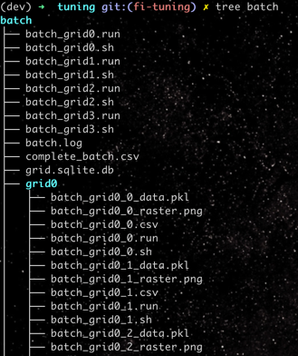

## TODO

@Nikita -- 
here are the two dummy functions:
[init.py](https://github.com/jchen6727/tuning/blob/fa8d77d72b633dd6510f6b56654c129aecc1ae16/init.py#L149)
[inner_grid.py](https://github.com/jchen6727/tuning/blob/60148221ef4aeea77307a798a433c6106d69cd6b/inner_grid.py#L100)

any analysis in the outer_grid.py I can only see as being useful for analyzing overall search results (solution space topography, pareto front, etc.)


however, by the end of the outer search, it will have relevant paths that can be loaded to describe any simulation results...

they need to be rewritten to compute relevant values,

may make sense to discuss how we want to perform large data I/O (I am using `pandas`, `sqlite`, `.csv`, and `.json` here, but only as an example/proof of concept)

@Scott --
Can review the notes, and if you have any questions on implementation forward to me, 

may have to implement some structural changes depending on what files we want to pass between the outer and inner grid, what datapoints we want to collect, what parameters and ranges we want to search, etc...

I also describe the `custom_template` at the end and would suggest seeing what deployment on the HPC of your choice will look like

For fitness functions/analysis will not be able to help as much.

of note, running locally can take awhile see [here](https://github.com/jchen6727/tuning/blob/dae528bfe33d108e20d64d976e004f30f088d422/cfg.py#L9)
, may want to shorten the simulation time for initial testing and validation, then bring back up after validating HPC deployment...

otherwise, please review the CHANGES.md and the two TODO.md , the powerpoint and notes0.png stored in this directory for reference on state of the project

### RUNNING BATCH
from the root directory, using MacOS and zsh, run `python outer_grid.py`

### NOTES - IMPLEMENTATION
here's what the current output structure looks like:


```aiexclude
(dev) ➜  tuning git:(fi-tuning) ✗ tree batch
batch
├── batch_grid0.run
├── batch_grid0.sh
├── batch_grid1.run
├── batch_grid1.sh
├── batch_grid2.run
├── batch_grid2.sh
├── batch_grid3.run
├── batch_grid3.sh
├── batch.log
├── complete_batch.csv
├── grid.sqlite.db
├── grid0
│   ├── batch_grid0_0_data.pkl
│   ├── batch_grid0_0_raster.png
│   ├── batch_grid0_0.csv
│   ├── batch_grid0_0.run
│   ├── batch_grid0_0.sh
│   ├── batch_grid0_1_data.pkl
│   ├── batch_grid0_1_raster.png
│   ├── batch_grid0_1.csv
│   ├── batch_grid0_1.run
│   ├── batch_grid0_1.sh
│   ├── batch_grid0_2_data.pkl
```

#### OUTER DIRECTORY
the top output directory contains the outer batch_grid# search .sh scripts which set the cell rule params
ex: `batch_grid0.sh`
```zsh
#!/usr/bin/env zsh

source ~/.zshrc
conda activate dev
export DYLD_LIBRARY_PATH="/opt/homebrew/Cellar/open-mpi/5.0.9/lib"
export MPI_LIB_NRN_PATH="/opt/homebrew/Cellar/open-mpi/5.0.9/lib"
export MSGFILE="/Users/jchen/dev/tuning/batch/batch_grid0.out"
export SGLFILE="/Users/jchen/dev/tuning/batch/batch_grid0.sgl"


export INTRUNTK0="multiply_parameters.kdr0.factor*=0"
export INTRUNTK1="multiply_parameters.cal0.factor*=0"
export INTRUNTK2="batch_id*=0"

export JOBID=$$
cd /Users/jchen/dev/tuning
python inner_grid.py > /Users/jchen/dev/tuning/batch/batch_grid0.run 2>&1
pid=$!
echo $pid >&1
```

those export commands for `multiply_parameters`... are used to set the specific multiplicands to modify the cell rules...

the run time output of each of these outer batch_grid# search .sh scripts are located in the corresponding .run files, and any debug statements in `batch.log`

when the search is completed, any collated data will be in the `grid.sqlite.db` database and the `complete_batch.csv` as well.

#### INNER DIRECTORY
within each subdirectory (`batch/grid#`), you can view the results of the internal grid search

each `batch_grid#_#` run generates a `.csv`, `.run`, `.sh`, `_data.pkl`, `_raster.png`:

* `.sh`: the shell script that initiates the run
* `.csv`: generated by the custom `sim_analysis` [function](https://github.com/jchen6727/tuning/blob/fa8d77d72b633dd6510f6b56654c129aecc1ae16/init.py#L149)
* `.run`: anything written to stdout or stderr during the run...
* `_data.pkl`: netpyne generated file (can pass the name if desired.)
* `_raster.png`: netpyne generated file

additionally, a `csv.json` containing all generated `batch_grid#_#.csv` paths and `results.csv` containing all collated data are generated by code within `inner_grid.py`

see the custom `inner_analysis` [function](https://github.com/jchen6727/tuning/blob/fa8d77d72b633dd6510f6b56654c129aecc1ae16/inner_grid.py#L100)
which will generate the `csv.json` [here](https://github.com/jchen6727/tuning/blob/fa8d77d72b633dd6510f6b56654c129aecc1ae16/inner_grid.py#L125),,, `results.csv` is from the dataframe [here](https://github.com/jchen6727/tuning/blob/fa8d77d72b633dd6510f6b56654c129aecc1ae16/inner_grid.py#L98)

each `grid#` inner directory will have its own `csv.json` and `results.csv`

#### PARAMETER SPACE
both `outer_grid.py` and `inner_grid.py` search through their own parameter space...

outer_grid parameter space [here](https://github.com/jchen6727/tuning/blob/fa8d77d72b633dd6510f6b56654c129aecc1ae16/outer_grid.py#L13)
```python
param_space = {
    'multiply_parameters.kdr0.factor': [1.0, 3.0],
    'multiply_parameters.cal0.factor': [0.5, 1.5],
}
```
this param_space dictates a small 2x2 grid space to search
these are initial parameter spaces used for demonstration, are passed through `inner_grid.py` without modification, and ultimately modify [this](https://github.com/jchen6727/tuning/blob/fa8d77d72b633dd6510f6b56654c129aecc1ae16/cfg.py#L162) structure in `cfg.py`
logic for this [here](https://github.com/jchen6727/tuning/blob/fa8d77d72b633dd6510f6b56654c129aecc1ae16/netParams.py#L124)


inner_grid parameter space [here](https://github.com/jchen6727/tuning/blob/fa8d77d72b633dd6510f6b56654c129aecc1ae16/inner_grid.py#L50)
```python
param_space = { # expand these parameter spaces...
    'ou_ramp_offset': [1.0, 4.00],
    'bkg_r': [25, 125],
#    'bkg_w': [0.1, 1.0],
}
```

this param_space dictates a small 2x2 grid space to search
the keys are the three parameters (amplitude of ramp, netstim background firing rate and weight of the netstim (commented out here)).
the inner grid will only pass through the `multiply_parameters` which are already set by the outer grid...

that is, each file generated by an inner_grid search within the same `INNER DIRECTORY` (`grid0`, `grid1`, ...`grid#`) will have the same `multiply_parameters` values, but different current clamp and netstim parameters...

again, these parameter space definitions are used for demonstration, and both will need to be expanded once we agree on structures, have internal code revised to reflect this, and begin to scale.

#### Custom submits

for flexibility with various HPC environments, I added support for custom submission scripts --

review [here](https://raw.githubusercontent.com/jchen6727/tuning/fa8d77d72b633dd6510f6b56654c129aecc1ae16/zsh_submit.toml)

the `command_template` describes what the script executes on the terminal. In this case:
```toml
command_template = "nohup zsh {output_path}.sh"
```
simply means that to execute the script, it is run through `nohup` and `zsh`
it may be necessary to alter `command_template` to execute
`qsub {output_path}.sh` or `sbatch {output_path}.sh` for instance, to run through an hpc job scheduler...

then, the script is generated from the `script_template`
```toml
script_template = """\
#!/usr/bin/env zsh

source ~/.zshrc
conda activate dev
export DYLD_LIBRARY_PATH="/opt/homebrew/Cellar/open-mpi/5.0.9/lib"
export MPI_LIB_NRN_PATH="/opt/homebrew/Cellar/open-mpi/5.0.9/lib"
{handles}
{env}

export JOBID=$$
cd {project_dir}
{command} > {stdout} 2>&1
pid=$!
echo $pid >&1
"""
```

again, this is specific to my environment (zsh, brew installed open-mpi, run locally, etc.)
you may wish to alter this to be suitable for other environments...
(for instance, `SBATCH` or `$#` scheduler settings)

